# Waste Classification Tool

Have you ever stood in front of a trash bin, unsure which one to use? With just an image of the waste, AI can now identify the correct disposal category for you.

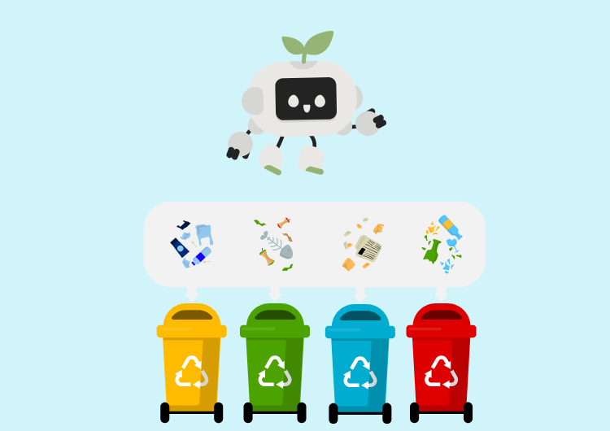

The project leverages deep learning and image recognition to automate waste classification, enabling faster, more accurate, and environmentally sustainable disposal processes. Through **four structured experiments**, I developed and evaluated multiple models to identify the optimal AI-driven solution. The final models offer a robust and scalable approach to waste classification, **with a test accuracy of 97%.**

Two models will be developed:

- a binary classification model to differentiate between biodegradable and non-biodegradable waste
- a ten-class classification model to further categorize waste into specific types. 

## Part 1: Background

### 1. Inspiration

This project was inspired by the open-source implementations introduced in the following papers:

- Zhang, Q., Zhu, Y., Wang, L., & Wang, X. (2021). Waste image classification based on transfer learning and convolutional neural network. *Waste Management, 135*, 20–28.[ ](https://www.sciencedirect.com/science/article/abs/pii/S0956053X21004815)https://www.sciencedirect.com/science/article/abs/pii/S0956053X21004815
- Fan, M., Zuo, K., Wang,  J., & Zhu, J. (2023). *A  lightweight multiscale convolutional neural network for garbage sorting*.  *Systems and Soft Computing, 5*,     200059.[ ](https://doi.org/10.1016/j.sasc.2023.200059)https://doi.org/10.1016/j.sasc.2023.200059
- Nahiduzzaman, M., Ahamed, M. F., Naznine, M., Karim, M. J., Kibria, H. B., Ayari, M. A., Khandakar, A., Ashraf, A., Ahsan, M., & Haider, J. (2025). An automated waste classification system using deep learning techniques: Toward efficient waste recycling and environmental sustainability. *Knowledge-Based Systems, 310*, 113028. https://www.sciencedirect.com/science/article/pii/S0950705125000760

### 2. Dataset

The dataset used is from [Kaggle](https://www.kaggle.com/datasets/sumn2u/garbage-classification-v2), containing 19,762 images categorized into 10 waste classes: metal, glass, biological, paper, battery, trash, cardboard, shoes, clothes, and plastic. Each class has 944–5,237 images, making it diverse and suitable for our experiments. 

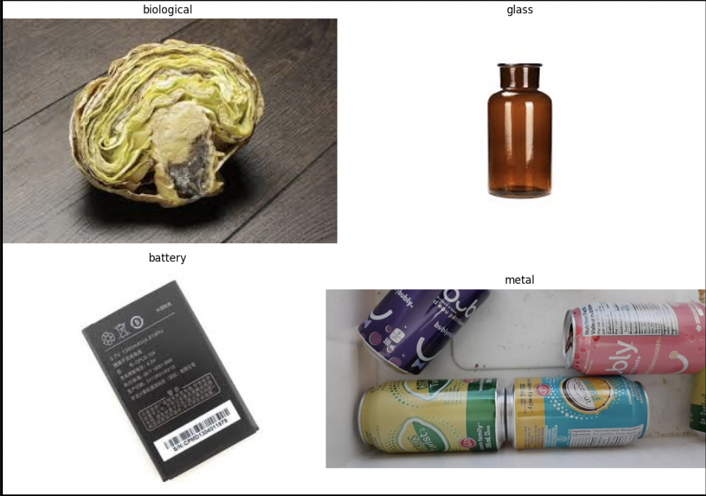

To prepare data for the binary classification model, I perform **label engineering** by grouping the original classes into biodegradable (biological, paper, clothes, shoes, cardboard) and non-biodegradable (metal, glass, battery, trash, plastic) categories. This results in 11,806 images labeled as biodegradable and 7,956 as non-biodegradable.

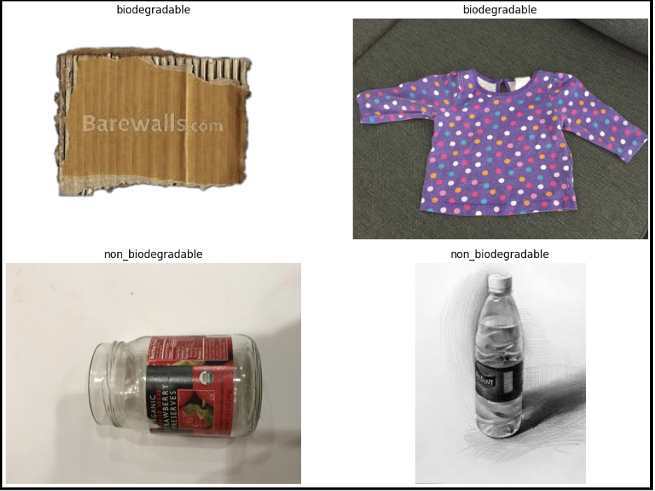

To reliably fine-tune our models and evaluate their performance, out of 19,762 images, I split the dataset into training (70%), validation (15%), and test (15%) sets. 

### 3. Performance Evaluation Methods

Performance metrics include:

- accuracy (the proportion of correct predictions)
- precision (the proportion of true positives among all positive predictions)
- recall (the proportion of actual positives correctly identified)
- F1 score (the harmonic mean of precision and recall)

To enhance model transparency, I employ heatmaps to visualize the key regions influencing model predictions, where warmer colors indicate higher importance. 

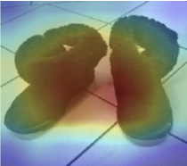

## Part 2: Methods

### 1. Convolutional Neural Network

The core deep learning algorithm used in this project is the Convolutional Neural Network (CNN), which is particularly effective for image classification tasks due to its ability to automatically learn spatial hierarchies of features. A typical CNN architecture consists of convolutional layers, pooling layers, flatten layers, and fully connected layers, each contributing uniquely to the learning process. 

- Convolutional layers apply learnable filters across the input image to extract spatial features such as edges, textures, and shapes. 
- Pooling layers reduce the spatial dimensions of the feature maps, preserving essential information. 
- The flatten layer reshapes the multi-dimensional feature maps into a one-dimensional vector, which is then passed to fully connected layers. 
- For the binary classification model, a sigmoid activation function is used in the output layer to generate binary classification results. For the ten-class classification model, a softmax activation function is employed.

### 2. Dual-Path Convolutional Neural Network

The Dual-Path Convolutional Neural Network (DP-CNN) has been shown to be effective in waste classification tasks. This architecture incorporates parallel convolutional layers with varying kernel sizes, enabling the model to capture features at multiple spatial scales. In CNNs, the kernel size defines the dimensions of the filter applied to the input image, which in turn determines the receptive field—the portion of the image the model processes at a time. Smaller kernels are effective for detecting fine-grained details, while larger kernels capture broader, more global features. By extracting feature maps in parallel using diverse kernel sizes and aggregating them through concatenation layers, the DP-CNN enhances the model’s adaptability to variations in object size and orientation within waste images. 

### 3. Transfer Learning

Leveraging pre-trained models such as ResNet and DenseNet, originally trained on the large-scale ImageNet dataset, has proven effective for waste classification tasks. ImageNet contains over 14 million labeled images across thousands of categories and is widely used for training and benchmarking image classification models. A list of ImageNet pre-trained models is available on the [MathWorks](https://www.mathworks.com/help/deeplearning/ug/pretrained-convolutional-neural-networks.html) website. In the experiments, I evaluate which of these pre-trained models best aligns with our dataset. These models serve as the base for our transfer learning approach, where I experiment with two strategies: freezing all layers of the base model or selectively unfreezing certain layers to allow fine-tuning.

### 4. Regularization Techniques

To reduce overfitting and improve model generalization, several regularization techniques are employed. 

- Dropout layers are added after fully connected layers to randomly deactivate a portion of neurons during training, preventing the model from becoming overly reliant on specific features. 
- Early stopping is applied to halt training when the validation loss or accuracy does not improve for more than five consecutive epochs. 
- In the Extreme Learning Machine (explained later), L2 regularization is used to penalize large weights by adding a regularization term to the loss function. 
- Data augmentation is applied to the training set using image transformations such as horizontal flipping, and zooming, which increases dataset diversity and enhances model robustness.

### 5. Ensemble-Extreme Learning Machine (En-ELM)

This method is inspired by the prior research on automated waste classification systems. The Extreme Learning Machine (ELM) is a single-hidden-layer feedforward neural network in which the input weights are randomly assigned and fixed, while only the output weights are learned. This architecture enables exceptionally fast training while maintaining strong generalization performance.

Two variants of the Extreme Learning Machine are used: the Pseudo-Inverse Extreme Learning Machine (PI-ELM) and the L2-Regularized Extreme Learning Machine (L2-RELM).

- In PI-ELM, the output weights are computed using the Moore-Penrose pseudoinverse of the hidden layer matrix, with a sigmoid function serving as the activation function. This approach is particularly efficient when the number of hidden neurons exceeds the number of training samples. 
- L2-RELM incorporates an L2 penalty on the output weights to mitigate overfitting.

My ensemble-based Extreme Learning Machine averages the outputs of both PI-ELM and L2-RELM, resulting in more balanced and reliable predictions.

### 6. Explainable AI

Explainable AI (XAI) techniques are employed to visualize the influential image regions that drive model decisions, thereby enhancing model transparency. In this study, Gradient-weighted Class Activation Mapping (Grad-CAM) is used to generate heatmaps that illustrate model attention across all four experiments. Grad-CAM highlights the most important regions in an image by leveraging the gradients of the output with respect to the final convolutional layer.

## Part 3: Experiments

### Experimental Framework Overview

I designed **four structured experiments** to develop robust waste image classification models. 

- **The first experiment** employed transfer learning on a simplified binary classification task to evaluate the effectiveness of ImageNet pre-trained models for my specific use case. The goal was to classify waste images as either biodegradable or non-biodegradable.
- **The second experiment** extended the transfer learning approach to a more complex ten-class classification task. This experiment aimed to identify the most effective pre-trained model for classifying images into ten categories: metal, glass, biological, paper, battery, trash, cardboard, shoes, clothes, and plastic.
- **In the third experiment**, I enhanced the best-performing model from Experiment 2 by integrating a Dual-Path Convolutional Neural Network (DP-CNN) structure to improve feature extraction and overall classification performance for the ten classes. 
- **The fourth experiment** explored the impact of an ensemble Extreme Learning Machine (En-ELM) applied to the features extracted from the best transfer learning model identified in Experiment 2. This aimed to further boost classification performance.

Across all four experiments, I evaluated model performance using test accuracy, confusion matrices, and Explainable AI techniques. These experiments ultimately yielded the best-performing models for both binary and ten-class waste image classification tasks.

### Experiment 1: Binary Classification using Transfer Learning

I applied transfer learning to perform binary classification of waste images into biodegradable and non-biodegradable categories. 

I selected MobileNetV2, a lightweight model pre-trained on ImageNet, comprising 3.5 million parameters and 154 layers. All base layers of MobileNetV2 were frozen to preserve the learned weights, allowing the model to function purely as a feature extractor. 

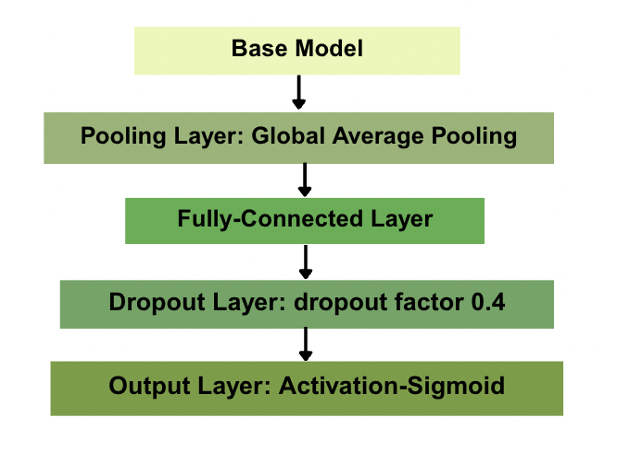

Despite minimal fine-tuning, the model achieved a test accuracy of 97.2%, with 98.0% accuracy on biodegradable items and 96.1% accuracy on non-biodegradable items. The confusion matrix for the test set is shown below. 

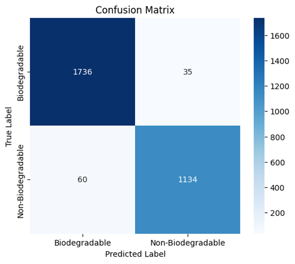

These results suggest that MobileNetV2 was able to generalize effectively across the two major waste categories with only shallow adaptation. Grad-CAM visualizations further validate the robust performance of the binary classification model. As illustrated below, the model accurately attends to meaningful image features while ignoring irrelevant background areas. 

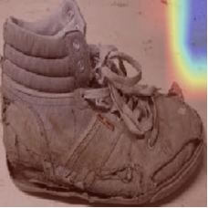

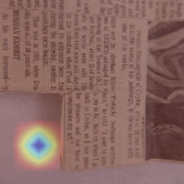

### Experiment 2: Ten-Class Classification using Transfer Learning

For the ten-class classification task, I explored the following popular pre-trained models on ImageNet: 

- MobilenetV2 (3.5M parameters)
- DenseNet201(20M parameters)
- ResNet101(44.6M parameters). 

These architectures were chosen based on their performance in image recognition benchmarks and their varying computational complexities.

For all trials in this experiment, the model architecture remained consistent. 

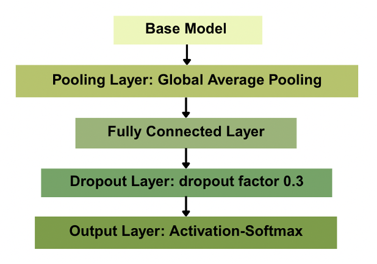

The only variations across trials were the choice of base model and the specific transfer learning strategy applied. Initially, I evaluated each model with all base layers frozen. Under this configuration.

- MobileNetV2, the most lightweight model, achieved a test accuracy of 92.0%
- DenseNet201, the second most lightweight option, outperformed others with a test accuracy of 93.4%
- ResNet101 achieved 93.3%

Among the three, **DenseNet201** offered the best balance between model size and classification performance, making it the optimal choice for further experimentation.

To further improve model performance, I conducted a fine-tuning trial by unfreezing the last 20 layers of DenseNet201. This adjustment increased the number of trainable parameters from approximately 490,000 to 1M. Compared to the fully frozen configuration, which yielded a test accuracy of 93.4%, the fine-tuned model achieved an improved accuracy of **95.0%**. This enhancement represents the optimal performance attained using DenseNet201, with the last 20 layers unfrozen during training.

The confusion matrix indicates that the DenseNet201 model performed consistently well across all categories, with particularly strong accuracy on well-represented classes such as clothes and glass. However, some misclassification persisted between visually similar categories—most notably between plastic and metal—suggesting opportunities for further improvement through more advanced architectures and fine-tuning strategies.

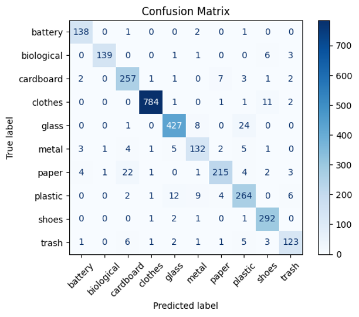

The attention heatmap demonstrates that the model effectively captures the overall structure of the input images (indicated by warmer regions), but tends to overlook finer details (represented by cooler areas). These limitations motivate the use of more advanced techniques in subsequent experiments to enhance classification precision. 


### Experiment 3: Ten-Class Classification using Transfer Learning with DP-CNN

In the third experiment, which focused on ten-class waste classification, I enhanced our best-performing pre-trained model—DenseNet201—by integrating it with a Dual-Path Convolutional Neural Network (DP-CNN) module to improve multi-scale feature extraction. 

In the enhanced architecture, feature maps extracted from DenseNet201 were fed into three parallel convolutional branches with kernel sizes of 7×7, 5×5, and 3×3. These outputs were then concatenated to form a richer, multi-scale representation before the final classification layer. This design aimed to complement DenseNet’s deep hierarchical learning with parallel pathways that explicitly capture both coarse and fine-grained spatial patterns. 

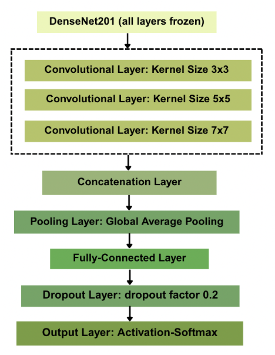

However, despite its conceptual advantages, the DenseNet + DP-CNN hybrid did not outperform the baseline DenseNet model. The test accuracy plateaued at approximately **92–93%**, offering no tangible improvement over the simpler transfer learning setup. Additionally, model performance was inconsistent across different waste categories, as indicated by the confusion matrix. Some classes experienced more than 15 misclassifications, particularly among visually similar items such as *plastic*, *glass*, and *metal*. 

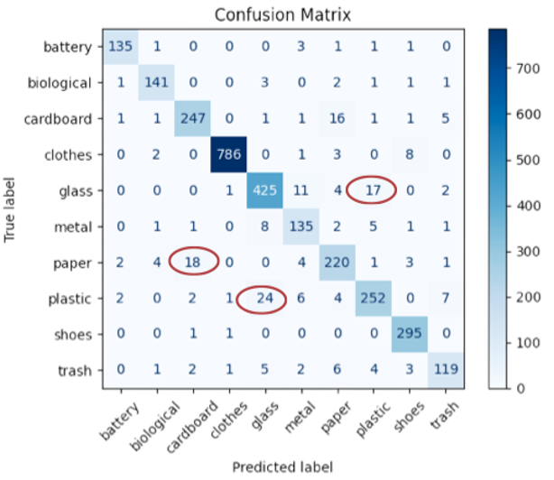

In addition, Grad-CAM visualizations reveal that the model often overlooks fine-grained object details while disproportionately focusing on background regions.  

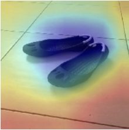

### Experiment 4: Ten-Class Classification using Transfer Learning with En-ELM

In this experiment, I built upon the optimal model from Experiment 2 by integrating an Ensemble Extreme Learning Machine. The goal was to assess whether the lightweight, closed-form training mechanism of the ELM ensemble could surpass the 95% test accuracy benchmark established previously. 

#### Step 1: Feature Extraction

I began by loading the optimal model obtained in Experiment 2 (DenseNet with the last 20 layers unfrozen) and extracting feature maps from its fully connected layer. These 256-dimensional feature representations served as input to our Extreme Learning Machine (ELM) ensemble.

#### Step 2: Feature Data Pre-processing

As the Extreme Learning Machine is a feedforward neural network, proper data preprocessing is essential prior to training. I applied standardization to all 256-dimensional feature representations and used one-hot encoding for the ten class labels.

#### Step 3: En-ELM Training Setup

I integrated two variants—Pseudoinverse ELM (PI-ELM) and Ridge-Regularized ELM (L2-RELM)—into our En-ELM. Both variants share the same random projection for the hidden layer but differ in how the output weights are computed: PI-ELM emphasizes maximal fitting using the Moore-Penrose pseudoinverse, while L2-RELM introduces L2 regularization to promote stable generalization. 

```python
# PI-ELM
def elm_train_pinv(X, Y, n_hidden):
    W = np.random.randn(X.shape[1], n_hidden)
    b = np.random.randn(n_hidden)
    H = 1 / (1 + np.exp(- (X @ W + b[np.newaxis, :])))  # activation function: Sigmoid
    beta = pinv(H) @ Y
    return W, b, beta

# L2-RELM
def elm_train_ridge(X, Y, n_hidden, alpha):
    W = np.random.randn(X.shape[1], n_hidden)
    b = np.random.randn(n_hidden)
    H = 1 / (1 + np.exp(- (X @ W + b[np.newaxis, :])))  # activation function: Sigmoid
    A = H.T @ H + alpha * np.eye(n_hidden)
    beta = np.linalg.inv(A) @ H.T @ Y
    return W, b, beta

# Prediction Function
def elm_predict(X, W, b, beta):
    H = 1 / (1 + np.exp(- (X @ W + b[np.newaxis, :])))  # activation function: Sigmoid
    return H @ beta
```

During inference, I compute the element-wise average of their raw class score outputs and select the class with the highest combined score. This simple ensemble strategy consistently outperforms either variant individually, offering the advantages of fast, closed-form training and enhanced robustness to feature noise.

#### Step 4: Hyper-parameter Search

A grid search was conducted on the training and validation sets to identify the optimal hyperparameters for the Ensemble ELM. Specifically, I tested different numbers of hidden neurons (e.g., 500, 1000) and L2 regularization values (e.g., 0.01, 0.001, 0.0001). Validation accuracy was computed for all combinations, and the highest accuracy of 96.8% was achieved with 1,000 hidden units and an L2 penalty of 0.0001.

#### Step 5: Final Prediction

Using the optimal hyperparameters—1,000 hidden units and an L2 penalty of 0.0001—I evaluated the model on the test set. This final evaluation achieved an overall accuracy of 97.3%, surpassing the 95% benchmark established in Experiment 2. As shown in the confusion matrix, the number of misclassifications per class was significantly reduced. Furthermore, all classes achieved precision, recall, and F1-scores above 90%, with most exceeding 97%. These results demonstrate that the model delivers robust and stable performance across all categories, establishing it as the optimal model among all four experiments.

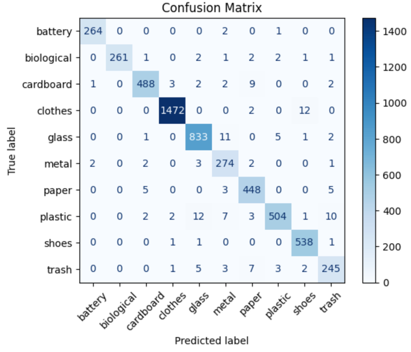

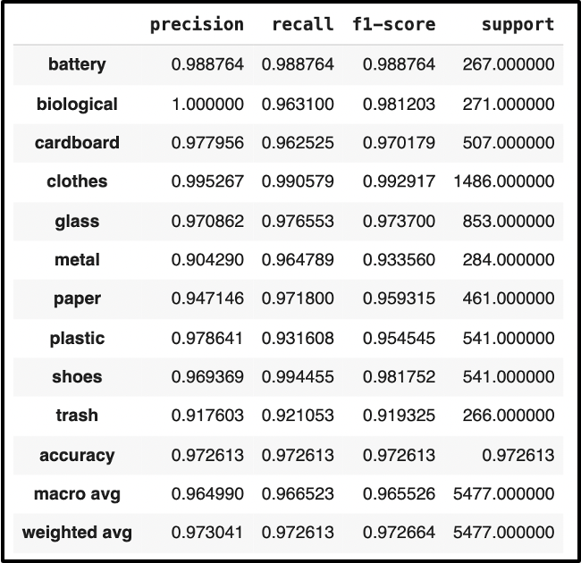

### Experiment Results 

|                   |           **Experiment 1**           |                       **Experiment 2**                       |       **Experiment 3**        |            **Experiment 4**             |
| ----------------- | :----------------------------------: | :----------------------------------------------------------: | :---------------------------: | :-------------------------------------: |
| **Approach**      |   Transfer Learning with MobileNet   | Transfer Learning with DenseNet (the last 20 layers unfrozen) | Transfer Learning with DP-CNN |      Transfer Learning with En-ELM      |
| **Test Accuracy** |                97.2%                 |                             95%                              |              93%              |                  97.3%                  |
| **Conclusion**    | The best binary classification model |     DenseNet201 is the most effective pre-trained model      |        No improvement         | The best ten-class classification model |

Experiment 1 achieved the best performance in binary classification, attaining a test accuracy of **97.2%** using transfer learning with the pre-trained MobileNetV2 model to classify waste images as either biodegradable or non-biodegradable.

Experiment 4 delivered the highest accuracy in ten-class classification, reaching a test accuracy of **97.3%** by combining DenseNet201 (with the last 20 layers unfrozen) and an Ensemble Extreme Learning Machine (En-ELM).

## Part 4: Conclusion

For the automated waste image classification tool, we delivered two final models: one for binary classification and one for ten-class classification. The binary model distinguishes between biodegradable and non-biodegradable waste, while the ten-class model assigns waste images to one of ten categories—metal, glass, biological, paper, battery, trash, cardboard, shoes, clothes, and plastic—enabling customizable applications based on user needs.

- **The binary classification model, based on MobileNetV2, achieved a test accuracy of 97.2% with minimal fine-tuning.** Its strong generalization capability and visual explainability make it well-suited for real-time deployment in public spaces or on mobile devices.

- **The ten-class classification model integrates DenseNet201 (with the last 20 layers unfrozen) and an Ensemble Extreme Learning Machine (En-ELM). This approach achieved a test accuracy of 97.3% and demonstrated consistently strong performance across all classes.** The results highlight the effectiveness of combining deep feature extraction with fast, robust classifiers to deliver both high precision and stable predictions.
